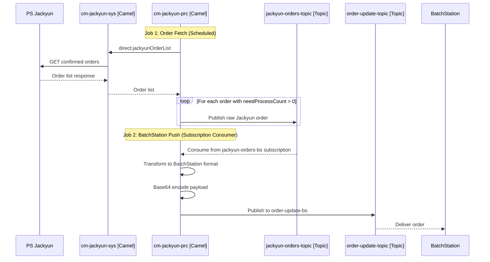
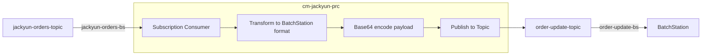

# Jackyun Pick Flow - Camel Integrations

This document outlines the required Camel integrations for the Jackyun pick and print process.

---

## Overview

The Jackyun pick flow is a **new integration for Jackyun → KH fulfillment**.





### Required Integrations

1. **Order Fetch Job** - Poll PS Jackyun for confirmed orders, filter to POD-only (`needProcessCount > 0`), publish raw Jackyun payload to `jackyun-orders-topic`
2. **BatchStation Push Job** - Consume raw Jackyun order from `jackyun-orders-bs` subscription, transform to BatchStation format, publish to `order-update-topic`

### Topic/Subscription Structure

| Topic | Subscription | Consumer | Purpose |
|-------|--------------|----------|---------|
| `jackyun-orders-topic` | `jackyun-orders-bs` | cm-jackyun-prc | BatchStation push |
| `order-update-topic` | `order-update-bs` | BatchStation | Order delivery |

---

## Job 1: Order Fetch (PS Jackyun → jackyun-orders-topic)

### Purpose
Poll PS Jackyun for inventory-confirmed orders, filter to items with `needProcessCount > 0`, and publish raw Jackyun payload to `jackyun-orders-topic`. No transformation at this stage - preserve original data for ADX capture and downstream processing.

### Polling Interval
Default: **15 minutes**

### Watermark / Cursor
Use `gmtCreate` to identify new orders since last sync. Store watermark in existing Postgres table.

> **Note:** `gmtCreate` is China time (UTC+8), not GMT.

### Jackyun Qimen API Integration

Fetch confirmed orders using the Qimen endpoint (same as existing Mule implementation).

**Endpoint:**
- **Host:** `zci2vl4joy.api.taobao.com` (dev)
- **Path:** `/router/qm`
- **Method:** POST
- **Content-Type:** `application/x-www-form-urlencoded`

**API Method:** `jackyun.tradenotsensitiveinfos.list.get`

**Key Request Parameters:**

| Parameter | Description |
|-----------|-------------|
| `tradeStatus` | `4112` (待发货已递交 - ready to ship, submitted) |
| `startModified` | Watermark timestamp (China time) |
| `endModified` | Current timestamp (China time) |
| `pageSize` | Results per page |
| `scrollId` | Pagination cursor |
| `fields` | Comprehensive field list |

**Authentication:** HMAC-SHA256 signature
- See existing `JackyunQimenSign.java` in ms-ecommerce-sys for signature generation

**Existing Mule Implementation:** `ms-ecommerce-sys/src/main/mule/jackyun-orders-qimen-impl.xml`

### Order Repushing

**Scenario 1: Order failed to sync to BatchStation**
- Bump the watermark timestamp back before the order's `gmtCreate`
- Job will pick it up on the next run

**Scenario 2: Order was pushed but needs to be re-sent**
- Order must be removed from BatchStation first
- We're sending `jackyun.order.create.request` event type - BatchStation will reject if order already exists

### Jackyun Order Payload

Raw order data from Jackyun API (published to `jackyun-orders-topic`):

```json
{
  "apiType": "74",
  "city": "海口市",
  "companyName": "葩勃颂（上海）商贸有限公司",
  "couponFee": "0",
  "customerName": "jcXUz7By1453822745455456256",
  "discountFee": "60.88",
  "flagNames": "有赠品,需仓内加工,部分缺货",
  "gmtCreate": "2025-12-25 19:47:30",
  "goodsDetail": [
    {
      "apiType": "74",
      "discountTotal": 0,
      "divideSellTotal": "238.12",
      "goodsFlagIds": "2348071648265831552,2152849337347802880,2164809322985948544,5100",
      "goodsFlagNames": "需仓内加工",
      "goodsId": 2301895685421040896,
      "goodsMemo": "",
      "goodsName": "PCS MS-SEMO-iPh17PMx-Lemonade",
      "goodsNo": "117614",
      "goodsPlatDiscountFee": "0",
      "goodsTags": "2348071648265831552,2152849337347802880,2164809322985948544",
      "isFit": "0",
      "needProcessCount": 1,
      "outerId": "P250729374320594",
      "platSkuId": "14913042431",
      "sellCount": 1,
      "sellPrice": 299,
      "sellTotal": 299,
      "shareOrderDiscountFee": "60.88",
      "shareOrderPlatDiscountFee": "0",
      "specId": "2301895685521704192",
      "subTradeId": "2377862089031222016",
      "taxFee": "27.39",
      "tradeId": "2377862088653440128"
    },
    {
      "apiType": "74",
      "discountTotal": 0,
      "goodsId": 2153834415795897472,
      "goodsMemo": "促销策略:线上渠道包裹卡10/29;",
      "goodsName": "Package Card",
      "goodsNo": "GWP024",
      "goodsPlatDiscountFee": "0",
      "goodsTags": "2164809322985948544",
      "isFit": "0",
      "needProcessCount": 0,
      "platSkuId": "",
      "sellCount": 1,
      "sellPrice": 0,
      "sellTotal": 0,
      "shareOrderDiscountFee": "0",
      "shareOrderPlatDiscountFee": "0",
      "specId": "2153834415821063296",
      "subTradeId": "2377862115522019968",
      "taxFee": "0",
      "tradeId": "2377862088653440128"
    }
  ],
  "id": "720276",
  "isDelete": "0",
  "logisticName": "顺丰速运（测试）",
  "mainPostid": "SF3268216246407",
  "orderNo": "S202512251092",
  "payStatus": "9",
  "payment": 238.12,
  "shopCode": "0026",
  "shopName": "PopSockets有赞旗舰店（YZ）",
  "shopTypeCode": "YOUZAN",
  "state": "海南省",
  "totalFee": "299",
  "tradeFrom": "1",
  "tradeId": "2377862088653440128",
  "tradeNo": "JY2512253581",
  "tradeOrderAssemblyGoodsDtoList": [],
  "tradeOrderColumnExt": {
    "tradeId": 2377862088653440128
  },
  "tradeOrderPayList": [
    {
      "payment": "238.12"
    }
  ],
  "warehouseCode": "0019",
  "warehouseId": "2084171544203264256",
  "warehouseName": "China 线上电商仓",
  "zip": ""
}
```

> **Example Order:** This payload contains both a POD item (`117614` with `needProcessCount: 1`) and a FG item (`GWP024` Package Card with `needProcessCount: 0`). Only items with `needProcessCount > 0` should be sent to BatchStation.

**Key Fields:**

| Field | Description |
|-------|-------------|
| `tradeNo` | Jackyun order ID (e.g., `JY2512253581`) |
| `tradeId` | Internal Jackyun trade ID |
| `orderNo` | Shop order number |
| `gmtCreate` | Order creation timestamp ⚠️ **Not actually GMT - this is China time (UTC+8)** |
| `lastShipTime` | Last ship time ⚠️ **Not actually GMT - this is China time (UTC+8)** |
| `warehouseCode` | Warehouse identifier |
| `flagNames` | Order flags (e.g., `需仓内加工` = needs in-warehouse processing) |
| `goodsDetail[].goodsNo` | Product SKU |
| `goodsDetail[].sellCount` | Quantity |
| `goodsDetail[].needProcessCount` | Items needing processing - **filter criteria: only include items where `needProcessCount > 0`** |
| `goodsDetail[].goodsFlagNames` | Item-level flags |

> **Filter Logic:** Only publish orders to the topic that contain at least one item with `needProcessCount > 0`. Items with `needProcessCount = 0` are not POD items and should be excluded from the BatchStation flow.

---

## Job 2: BatchStation Push (jackyun-orders-bs → order-update-topic)

### Purpose
Consume raw Jackyun orders from `jackyun-orders-bs` subscription, transform to BatchStation payload format, wrap in Service Bus envelope, and publish to `order-update-topic`. This job owns the Jackyun → BatchStation field mapping.

### Flow





### Service Bus Message Structure

Following the Azure Service Bus Architecture standard envelope:

**Topic:** `order-update-topic`
**Subscription:** `order-update-bs`
**Event Type:** `jackyun.order.create.request`

```json
{
  "trace_id": "694ab939000000000ed6aeb3094212c4",
  "span_id": "b7ad6b7169203331",
  "event_type": "jackyun.order.create.request",
  "timestamp": "2025-01-15T10:30:00.000Z",
  "status": "request",
  "code": 200,
  "message": "New POD order from Jackyun for KH fulfillment",
  "object_type": "ORDER",
  "refe_id": "JY2512253581",
  "requested_payload": "<Base64 encoded payload - see below>",
  "response_payload": null
}
```

| Field | Type | Description |
|-------|------|-------------|
| `trace_id` | String | Trace ID for correlation (32 hex chars) |
| `span_id` | String | Span ID for this operation (16 hex chars) |
| `event_type` | String | Event type identifier |
| `timestamp` | ISO 8601 | Message creation timestamp |
| `status` | String | `request`, `SUCCESS`, `FAILED` |
| `code` | Integer | HTTP-style status code (200, 400, 500) |
| `message` | String | Human-readable message |
| `object_type` | String | `ORDER`, `FULFILLMENT`, `BATCH`, etc. |
| `refe_id` | String | Reference ID (order_id, batch_id, etc.) |
| `requested_payload` | String | Base64 encoded request data |
| `response_payload` | Object | Response data (null for requests) |

### Field Mapping: Jackyun → BatchStation

| BatchStation Field | Jackyun Source Field | Transformation |
|--------------------|------------------|----------------|
| `siteId` | _(hardcoded)_ | Ashan to provide value |
| `orderId` | `tradeNo` | Direct mapping |
| `shipping` | _(null)_ | Not needed for BatchStation print flow |
| `date` | `gmtCreate` | Parse and convert to `YYYY-MM-DD` (remember: China time, not GMT) |
| `status` | _(hardcoded)_ | `"NEW"` |
| `orderItems[].orderLineNumber` | _(generated)_ | Generate sequence: `10000`, `20000`, etc. |
| `orderItems[].quantity` | `goodsDetail[].sellCount` | Direct mapping |
| `orderItems[].productSku` | `goodsDetail[].goodsNo` | Direct mapping |
| `orderItems[].imageType` | `goodsDetail[].needProcessCount` | `POD` if `needProcessCount > 0`, else `FG` - **TBD, need to confirm with BatchStation** |
| `orderItems[].recipeId` | _(empty)_ | No CYO support for now |

> **Note:** Need to add `omsOrderId` field for PrintStation - use Jackyun `orderNo` value.

### BatchStation Payload Structure (requested_payload decoded)

BatchStation expects this payload format (matching current OMS → BatchStation structure):

```json
{
  "siteId": "KH",
  "orderId": "JY2512253581",
  "shipping": null,
  "date": "2025-12-25",
  "status": "NEW",
  "orderItems": [
    {
      "orderLineNumber": "10000",
      "quantity": 1,
      "productSku": "117614",
      "imageType": "POD",
      "recipeId": ""
    },
    {
      "orderLineNumber": "20000",
      "quantity": 1,
      "productSku": "GWP024",
      "imageType": "FG",
      "recipeId": ""
    }
  ]
}
```

| Field | Type | Description |
|-------|------|-------------|
| `siteId` | String | Fulfillment site (e.g., `KH` for China, `CROF` for Colorado) |
| `orderId` | String | External order ID (Jackyun order number) |
| `shipping` | String | Shipping address (comma-separated) |
| `date` | String | Order date (YYYY-MM-DD) |
| `status` | String | Order status (`NEW`) |
| `orderItems[].orderLineNumber` | String | Line number (10000, 20000, etc.) |
| `orderItems[].quantity` | Integer | Quantity ordered |
| `orderItems[].productSku` | String | Product SKU |
| `orderItems[].imageType` | String | Image type (`STD`, `POD`, etc.) |
| `orderItems[].recipeId` | String | Recipe/print configuration ID |

---

## Open Questions

1. **PS Jackyun Order API:** What is the exact endpoint and request format for fetching confirmed POD orders?
2. **Order Filter Criteria:** How do we identify orders ready for pick (status, flags)?
3. **Topic Provisioning:** Confirm `jackyun-orders-topic` and `jackyun-orders-bs` subscription provisioning in Azure Service Bus
4. **Field Mapping:** How do Jackyun order fields map to BatchStation payload? (especially `omsOrderId`, `assemblyOrderId`)
5. **FG-Only Orders:** Are these handled separately or ignored in the Jackyun pick flow?
6. **Topic Naming:** Do we need environment-specific names (e.g., `jackyun-orders-topic-prod` vs `jackyun-orders-topic-staging`) or a single name across environments?
7. **PRC/SYS Architecture:** Does cm-jackyun-prc use cm-jackyun-sys for fetching orders from PS Jackyun? (Diagram assumes yes)
8. **Site ID:** What should `siteId` be for Jackyun orders? (Currently set to `KH` in payload example)
9. **BatchStation Payload:** Confirm exact payload requirements for BatchStation - what fields are required vs optional?
10. **Duplicates / Updates:** How do we handle duplicate orders? Are these create-only or can we send updates?
11. **FG + POD Same SKU:** How do we handle situations where we have FG and POD of the same SKU (e.g., partial inventory fulfillment)?
12. **Non-Printable SKUs:** How do we send non-printable (FG) SKUs to BatchStation? Need a sample OMS order to see how/if we're passing this data currently.
13. **Watermark Storage:** Confirm approach for storing sync watermark - use existing Postgres table? What table/schema?
14. **imageType Values:** What values does BatchStation expect for `imageType`? Is `POD`/`FG` correct, or something else?

---

## Related Documentation

- [Jackyun Pick and Print Process](./pick-print-process)
