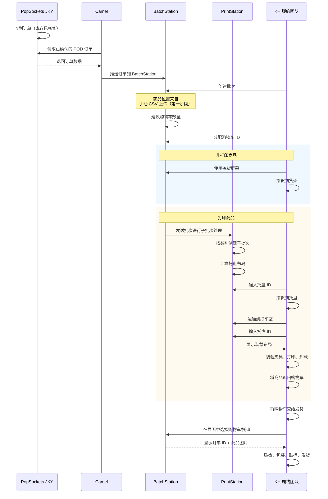
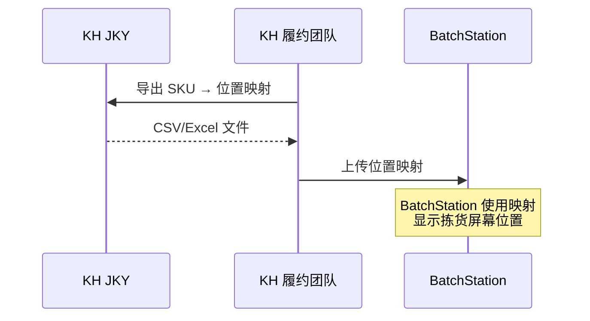
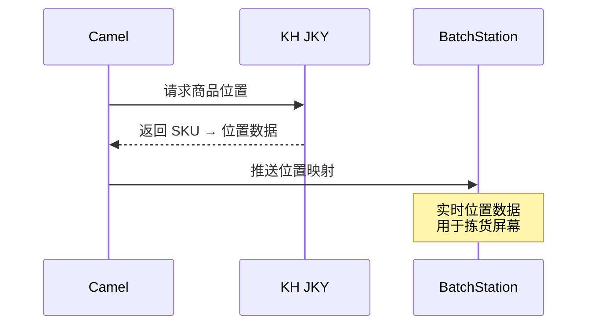

# Jackyun 拣货和打印流程

**[English Version](./pick-print-process)**

---

## POD 订单（需要打印）

包含按需打印商品的订单通过 BatchStation 和 PrintStation 处理。

---

## 商品位置集成

### 第一阶段：手动 SKU-位置映射（当前）

消耗品库存商品位置的临时解决方案：

### 第二阶段：自动位置同步（未来）

取代手动 CSV 上传。Camel 将直接从 KH 吉客云 拉取每个消耗品库存商品的位置信息并推送到 BatchStation：

---

## 1. 订单接收与路由

1. 订单进入吉客云（假设库存已核实）
2. **决策点：** 订单类型路由
   - **2.1** 仅成品订单 → 直接发货
   - **2.2** 订单包含 POD → 继续进行批次处理

---

## 2. 批次创建

3. Camel 拉取库存确认的订单并交给 BatchStation
4. 技术人员创建批次
5. BatchStation 从 KH 吉客云 拉取所有商品详情
6. BatchStation 根据订单数量建议购物车数量（靠近组装区的墙边购物车）
7. 员工选择购物车并将购物车 ID 输入批次

---

## 3. 非打印商品拣货

8. 拣货员使用非打印商品拣货屏幕定位商品，收集到运输购物车的托盘中，带到货架
9. 质检人员查看非打印商品的拣货屏幕（包装、指环等）并放入货架上的标记位置

---

## 4. 打印商品准备

10. PrintStation 根据商品类别创建子批次
11. 每个子批次将相同商品分组排列在装载布局上
12. PrintStation 计算每种类型的所有托盘，要求输入托盘 ID
13. 拣货员将打印商品拣到运输购物车，带到托盘桌
14. 分拣/质检员输入托盘 ID（或扫描二维码），使用装载布局找到槽位和托盘号，将商品装入塑料托盘槽位
15. 托盘运输到打印室

---

## 5. 打印

16. 打印技术员在 PrintStation 输入托盘 ID → 显示装载布局
17. 打印技术员将托盘中的商品装载到夹具后进行打印
18. 打印完成的商品卸载回托盘，交还给分拣员

---

## 6. 打印后分拣

19. 分拣/质检员参考卸载布局，将打印完成的商品放回购物车
20. 批次中所有打印和非打印商品拣货完成 → 完成的购物车交给发货

---

## 7. 组装与发货

21. 组装/发货员工拿到购物车，在界面中选择购物车，选择特定托盘
22. 托盘显示订单 ID 和商品列表（包含打印商品图片）→ 员工与吉客云订单商品对比并质检
23. 托盘中的已包装商品 → 打印发货标签 → 发货

---

## 待解决问题

- **仅成品订单：** 如何处理？是按照常规 KH 流程还是通过 BatchStation？

---

## 涉及系统

| 系统 | 角色 |
|--------|------|
| 吉客云 | 订单来源、库存 |
| Camel | 拉取已确认订单，交给 BatchStation |
| BatchStation | 批次创建、购物车分配、商品详情 |
| PrintStation | 子批次创建、托盘管理、打印任务 |
| KH 吉客云 | 履约中心运营 |
