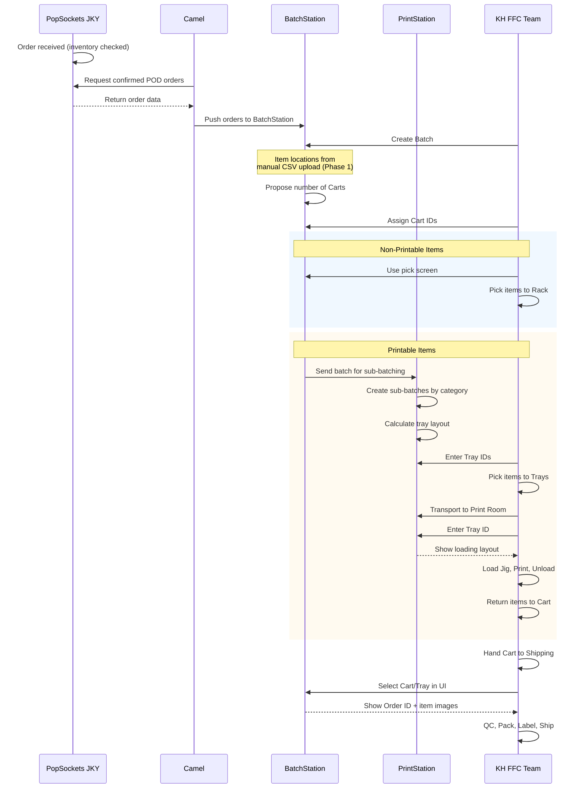
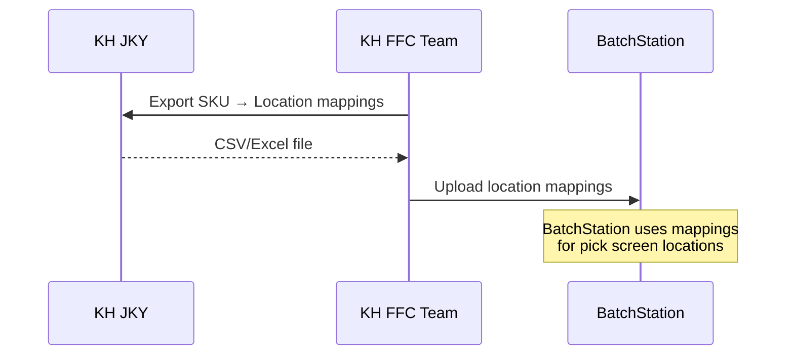
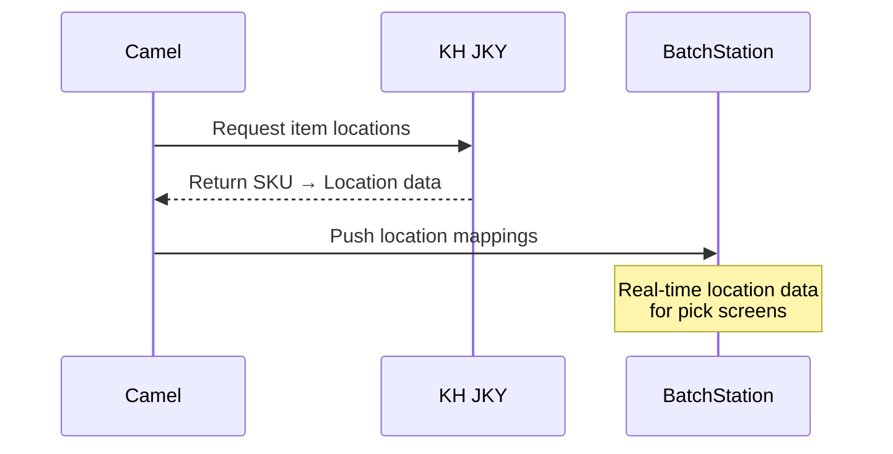

# Jackyun Pick and Print Process

**[简体中文版](./pick-print-process-zh)**

---

## POD Orders (Print Required)

Orders containing print-on-demand items flow through BatchStation and PrintStation.

---

## Item Location Integration

### Phase 1: Manual SKU-Location Mapping (Current)

Temporary solution for consumable inventory item locations:

### Phase 2: Automated Location Sync (Future)

Replaces the manual CSV upload. Camel will pull item locations directly from KH Jackyun for each consumable inventory item and push to BatchStation:

---

## 1. Order Intake & Routing

1. Orders come into Jackyun (inventory assumed checked)
2. **Decision Point:** Order type routing
   - **2.1** FG Only orders → Direct Ship
   - **2.2** Orders include POD → Continue to batching

---

## 2. Batch Creation

3. Camel pulls inventory-confirmed orders and hands over to BatchStation
4. Tech creates the Batch
5. BatchStation pulls all item details from KH Jackyun
6. BatchStation proposes number of Carts based on order count (wall carts near Assembly)
7. Staff selects Carts and enters Cart IDs to the Batch

---

## 3. Non-Printable Item Picking

8. Collector Staff uses Non-Printable Item pick screen to locate items, collect into Trays in transport Cart, bring to Rack
9. QC Person reviews pick screen for non-print items (packaging, rings, etc.) and drops into marked location on rack

---

## 4. Printable Item Preparation

10. PrintStation creates sub-batches according to item category
11. Each sub-batch arranged with same items grouped together on loading layout
12. PrintStation calculates all trays for each type, asks to enter Tray IDs
13. Picking staff picks printable items into transport cart, brings to table with Trays
14. Sorting/QC staff enters Tray ID (or scans QR), uses loading layout to find slots and tray numbers, loads slots on plastic tray
15. Trays transported to Printing Room

---

## 5. Printing

16. Print Tech enters Tray ID in PrintStation → shows loading layout
17. Print Tech prints items after loading Jig with items from Tray
18. Printed items unloaded back to tray, handed back to Sorting staff

---

## 6. Post-Print Sorting

19. Sorting/QC Staff refers to Unloading layout, puts printed items back to Cart
20. All printed and non-printed items picked for batch → finished carts handed to Shipping

---

## 7. Assembly & Shipping

21. Assembly/Shipping staff gets Cart, selects Cart in UI, selects specific tray
22. Tray shows ORDER ID and items list with images of printed items → staff compares with Jackyun order items and QC
23. Packed items from Tray → shipping labels printed → shipped out

---

## Open Questions

- **FG-Only Orders:** How are we handling these? Will they follow the regular KH process or go through BatchStation?

---

## Systems Involved

| System | Role |
|--------|------|
| Jackyun | Order source, inventory |
| Camel | Pulls confirmed orders, hands to BatchStation |
| BatchStation | Batch creation, cart assignment, item details |
| PrintStation | Sub-batch creation, tray management, print jobs |
| KH Jackyun | Fulfillment center operations |
